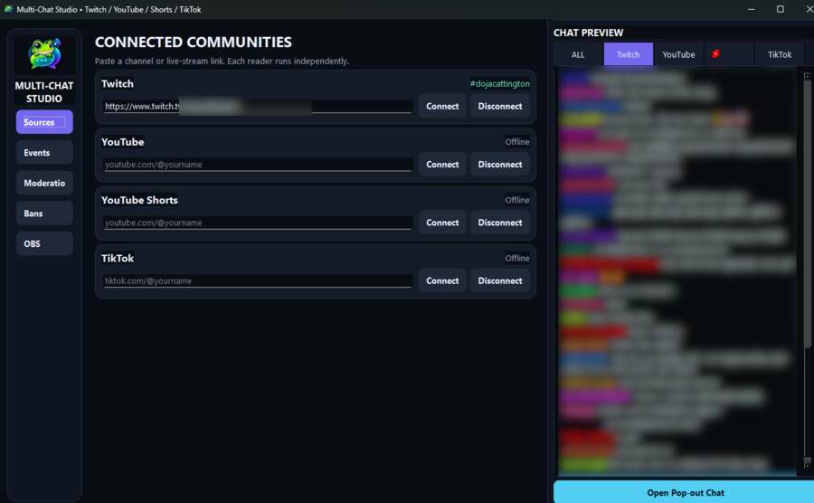
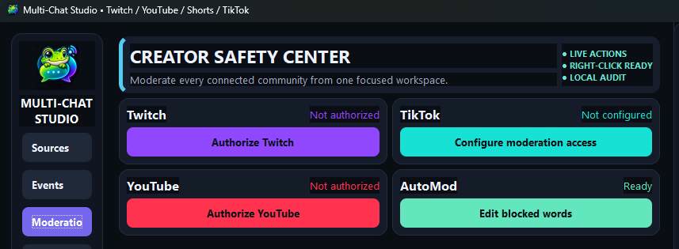
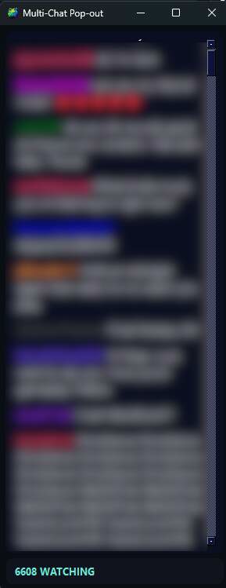

<div align="center">
  

  # Leapcast Studio

  **A Windows multi-chat system that also functions as a focused moderation device.**

  NOTE: THIS IS IN EARLY DEVELOPMENT SO THERE WILL BE LOTS OF UPDATE PUSHES TO COME IN THE NEXT MONTH OR SO!! Once everything is fixed and polished, updates will be periodically!

  Follow Twitch, YouTube, YouTube Shorts, TikTok LIVE, Kick, and Rumble communities, moderate faster, show chat in OBS, and surface Streamlabs and Rumble alerts without juggling a wall of browser windows.

  [Download for Windows](https://github.com/reallefroge/MultiStreamChat/releases) · [Changelog](CHANGELOG.md) · [First look](#first-look) · [Features](#features) · [Report a problem](https://github.com/reallefroge/MultiStreamChat/issues)
</div>

> [!IMPORTANT]
> Leapcast Studio is a **multi-chat and moderation system**, not broadcasting software. Keep using OBS Studio or your preferred encoder to send video. Leapcast Studio works beside it as a moderation device for chat, alerts, viewer information, restrictions, AutoMod, and the browser-source overlay.

## Download

Leapcast Studio is made for **64-bit Windows 10 and Windows 11**.

1. Open the [Releases page](https://github.com/reallefroge/MultiStreamChat/releases).
2. Open the newest release marked **Latest**.
3. Download `LeapcastStudio-Setup-<version>.exe`.
4. Run the installer and launch **Leapcast Studio** from the Start menu or optional desktop shortcut.

The installer includes the required Qt runtime. Streamers and moderators do **not** need Python, CMake, Visual Studio, the Qt SDK, Tesseract, or loose image files.

Updates are one-click: Leapcast Studio downloads the verified installer, closes itself, removes the previous program files, installs the fresh minimum runtime, preserves settings stored in AppData, and reopens automatically.

> [!NOTE]
> If the Releases page does not contain a Windows installer yet, a public packaged build has not been published. The **Source code** ZIP files generated by GitHub are for developers and are not a ready-to-run copy of the app.

> [!WARNING]
> An unsigned release may trigger Microsoft Defender SmartScreen while the project is building download reputation. Always download from this repository, check the release notes, and scan the installer before running it.

## First look

### Connect every community

The main window keeps source connections on the left and a live, platform-filtered chat preview on the right. Sensitive channel and message information in these images has been blurred for privacy.



### Moderate from one safety center

Configure access for Twitch, YouTube, and TikTok, then manage the shared blocked-word list from the AutoMod card.



### Keep chat visible while you stream

The compact, always-on-top pop-out keeps the combined conversation and total viewer count within view without taking over the desktop.

<p align="center">
  
</p>

The interface is organized into five focused areas:

- **Sources** — connect or disconnect each chat independently.
- **Events** — show Streamlabs events plus new Rumble followers, subscribers, and gifted subscriptions as the same alert cards in the streamer chat preview and pop-out; Streamlabs Alert Box audio remains optional for Streamlabs events.
- **Moderation** — connect Twitch and YouTube moderation, open TikTok's own LIVE controls, and manage AutoMod.
- **Bans** — review and remove supported Twitch and YouTube restrictions.
- **OBS** — copy the local browser-source URL, send a test message, clear the overlay, and set its fade timer.

## Features

### One chat view, four communities

- Reads Twitch, YouTube Live, YouTube Shorts Live, TikTok LIVE, Kick, and Rumble chat.
- Displays Twitch Channel Point custom reward redemptions (for example, “redeemed Hydrate”) in Windows chat and Phone Connect after Twitch authorization includes `channel:read:redemptions`.
- Optionally displays TikTok joins, follows, and likes in the pop-out only; these activity lines never enter the OBS overlay.
- Provides independent platform-icon toggles for program/pop-out messages and OBS overlay messages.
- Provides one **All** feed plus separate branded tabs for Twitch, YouTube, Shorts, TikTok, Kick, and Rumble.
- Uses clear Twitch, YouTube, Shorts, TikTok, Kick, and Rumble icons to identify each source.
- Retries supported Twitch, YouTube, and Streamlabs connections after temporary failures.
- Tracks platform viewer counts for the pop-out and local OBS endpoints, and shows a live per-platform breakdown in the pop-out whenever two or more sources are concurrently connected.

### Moderation built for a live workflow

- Integrated Twitch and YouTube moderation access, plus a direct shortcut to the configured TikTok LIVE room.
- Five-minute automated timeouts or mutes when AutoMod detects a configured violation.
- AutoMod recognizes when it isn't a moderator on a connected channel (for example, a channel added just to watch or test chat) and stops retrying and re-warning after the first attempt, instead of repeating a warning dialog for every flagged message.
- Editable blocked-word list with checks for common leetspeak, separators, repeated letters, Unicode lookalikes, and one-character misspellings.
- Spam checks for repeated messages, floods, excessive capitals, follower/viewer promotion, and optionally links.
- Twitch ban and timeout retrieval and removal.
- YouTube restriction history for moderation actions created by Leapcast Studio.
- Local JSON audit history for visible chat messages, Streamlabs events, and Rumble follow/subscription alerts. Blocked Kick and Rumble messages are not stored.

Platform APIs decide which actions are available, and the signed-in account must have the required channel permissions.

### OBS and pop-out chat

- Serves a local browser-source overlay at `http://127.0.0.1:8080/` by default.
- Includes copy, open, test, clear, and message-fade controls.
- Offers an always-on-top pop-out chat with combined viewer totals.
- Lets you set the pop-out's background opacity independently of chat text and Streamlabs alerts, which always stay fully readable.
- Creates a Twitch clip of the live broadcast directly from the pop-out's Clip button — the same action as twitch.tv's own Clip button — and copies the editor link to your clipboard.
- Shows Streamlabs alert cards in Leapcast Studio's streamer-facing chat preview while keeping them out of the OBS overlay feed.
- Layers the streamer's native Streamlabs Alert Box animation over the pop-out chat, with its selected sound and visuals kept in sync.

### Streamlabs events and optional audio

- Receives supported donations, follows, subscriptions, memberships, Super Chats, Bits, raids, and hosts through Streamlabs.
- Displays events in the pop-out chat.
- Can optionally load your Streamlabs Alert Box so its selected audio plays with the matching alert.
- Leaves Streamlabs alert sound and noise-effect choices under your control.

### Native Windows packaging

- Native C++20 and Qt 6 application with no Python interpreter or Python subprocess.
- Brand and platform artwork compiled into the executable.
- Installer bundles the desktop runtime and supports per-user installation without administrator rights.
- Checks this repository's Releases feed for updates and verifies a published SHA-256 digest when GitHub provides one.

## Quick start

1. Open **Sources** and paste the channel/profile URL for every platform you want to use. Rumble also requires its private Live Stream API URL under **Keys**.
2. Select **Connect** beside each community you want to watch.
3. Open **Moderation** only if you want moderation actions. For Twitch, select **Connect Twitch** and approve Leapcast Studio in your browser—no Client ID, token, or numeric user ID is requested.
4. Open **OBS**, select **Copy URL**, and add that address to OBS as a **Browser Source**.
5. Use **Test message** before going live, then adjust the fade timer to match your layout.
6. Optionally connect Streamlabs under **Events** and enable Alert Box audio syncing.

Saved source links, preferences, audit files, and authentication values stay in the app's local Windows application-data folder. Authentication values are currently stored locally rather than in Windows Credential Manager, so protect your Windows account and never share your settings file.

When upgrading from Multi-Chat Studio, Leapcast Studio copies the existing settings, blocked-word list, and audit files into the new application-data folder the first time it starts.

### Platform authorization

Twitch uses its public-client device authorization flow. Leapcast Studio opens Twitch's approval page, receives the access token and account ID automatically, and refreshes the session without asking users to copy credentials.

Release maintainers configure the public Twitch application ID once by setting the repository Actions variable `TWITCH_CLIENT_ID`, or by passing `-TwitchClientId` to `build-installer.ps1`. This is application configuration, not an end-user setup step. Never embed a Twitch Client Secret in the desktop app. Release builds now stop with a clear error if this value is missing, preventing another installer with a non-working Twitch button.

YouTube now remembers a saved moderation connection and immediately shows **Connected** instead of continuing to display **Not authorized**.

TikTok does not require a token or developer account in Leapcast Studio:

- **YouTube:** [Google Cloud API Credentials](https://console.cloud.google.com/apis/credentials) for a project, YouTube Data API access, and OAuth credentials.
- **TikTok chat and viewer counts:** connect a TikTok profile from **Sources**.
- **TikTok moderation:** select **Open TikTok LIVE in browser**. Leapcast opens the configured creator's live room directly so the user can moderate with TikTok's own controls.

## How it compares

Leapcast Studio is intentionally a focused Windows chat and moderation companion. It does not try to replace a complete browser studio or support every social network.

Leapcast Studio is completely free and always will be — no subscription, no paid tier, no feature paywall, and no trial period that expires. Several of the closest alternatives below charge a recurring subscription to unlock their multistream chat, on-stream overlays, or higher usage limits; paying more doesn't automatically mean a better fit for a focused Windows chat and moderation workflow, and for that specific job, Leapcast Studio aims to match or beat what those paid tiers offer at zero cost.

| Product | Cost | Where it is strongest | Trade-offs compared with Leapcast Studio |
|---|---|---|---|
| **Leapcast Studio** | Free, no paid tier | Native Windows multi-chat for Twitch, YouTube, Shorts, TikTok, Kick, and Rumble; built-in AutoMod for supported moderation APIs; local OBS overlay; Streamlabs event/audio integration; no Python dependency | Windows-only; Kick/TikTok web readers can require maintenance when platform pages change; TikTok and Rumble moderation open the platform's live controls; Kick moderation is hidden until authenticated support is implemented; no video encoding, hosted studio, guest system, or cloud multistream relay |
| [**Restream Chat**](https://support.restream.io/en/articles/2379624-what-is-restream-chat) | Free tier, with Restream's broader multistreaming/production features gated behind paid plans | Established unified chat with desktop and Studio access, on-stream overlays, replies, and cross-platform relay | Best suited to the wider Restream account and broadcasting workflow; Leapcast Studio is more narrowly focused on local OBS use and its own AutoMod/moderation workspace, at no cost |
| [**Social Stream Ninja**](https://socialstream.ninja/docs/features) | Free and open-source | Free and open-source browser tooling, very broad platform support, two-way chat, templates, CSS/JavaScript customization, and automation hooks | The extension, pop-out chat, dashboard, and advanced customization can mean more setup; Leapcast Studio offers a smaller, opinionated native Windows interface |
| [**Streamlabs**](https://streamlabs.com/multistream) | Free with a paid Streamlabs Ultra subscription for its fuller multistream/creator-tool set | Full streaming suite with multistreaming, widgets, alerts, themes, and creator tools in one ecosystem | Much broader and heavier than a dedicated chat companion; some multistream functionality sits behind the paid Ultra tier, while Leapcast Studio is free and designed to sit beside OBS and reuse Streamlabs alerts |
| [**StreamYard**](https://streamyard.com/) | Free tier with limited destinations; paid subscription for more destinations and features | Browser-based hosted production, guest management, multistreaming, recordings, and on-screen comments | Designed to produce and send the whole show, with its strongest features paid; Leapcast Studio does not provide a hosted studio, but keeps chat and moderation local, free, alongside an existing OBS setup |

### Why choose Leapcast Studio?

**Pros**

- Focused interface instead of a full broadcasting suite.
- Separate connection controls and chat tabs for all four supported sources.
- AutoMod can apply the same five-minute response across supported communities.
- Local OBS and pop-out views do not require a hosted overlay service.
- Standalone Windows installer; no development environment required.
- Completely free and will never require a subscription, paid tier, or trial — including AutoMod, the pop-out chat, and the OBS overlay, all features paid competitors often gate behind a paid plan.

**Current limitations**

- Windows 10/11 x64 only; no macOS, Linux, mobile, or web edition.
- Supports fewer destinations than broad browser-extension and cloud-studio competitors.
- The app does not send video or multistream the broadcast itself.
- YouTube moderation still requires the correct Google access and account permissions; Twitch uses account authorization; TikTok moderation opens the creator's live room in the browser.
- YouTube's Bans page tracks restrictions created through Leapcast Studio; it is not a complete server-side history of every YouTube moderation action.
- Kick, TikTok, and YouTube web integrations can require maintenance when those platforms change their pages or endpoints.
- New unsigned installers may show a Windows SmartScreen warning.

Feature availability can change when a platform changes its API or third-party access rules. The comparison above describes product positioning, not a claim that one tool is best for every creator.

## Privacy and account access

- The application has no Python runtime and does not compile creator tokens into the repository.
- Connections go directly to the services needed for enabled features, including Twitch, YouTube, TikTok, Kick, Rumble, Streamlabs, and GitHub Releases for update checks.
- Chat and event audit data is written locally.
- Only grant the moderation scopes you need. Revoke or rotate a token through its platform if it is ever exposed.

## For developers

### Build prerequisites

- Visual Studio 2022 with **Desktop development with C++**
- Qt 6.5 or newer for MSVC 2022 x64, including WebEngine and WebSockets
- CMake 3.24 or newer
- Inno Setup 6 to produce the Windows installer

### Configure and build

```powershell
.\build-installer.ps1
```

The script reads the single version number from `VERSION`, builds the app,
bundles Qt, creates the installer, and writes the installer plus its SHA-256
file to `artifacts`. If Qt is not on `PATH`, pass its location with
`-QtRoot`.

For a complete one-command release workflow, see
[PUBLISHING.md](PUBLISHING.md).

## Support and contributions

- Found a reproducible bug? [Open an issue](https://github.com/reallefroge/MultiStreamChat/issues) with the app version, platform involved, expected result, actual result, and a screenshot with private information blurred.
- Want to contribute? Fork the repository, make a focused change, test it on Windows, and open a pull request.
- Never include access tokens, client secrets, stream keys, unblurred chat logs, or personal channel data in an issue.

---

Leapcast Studio · Built by Lefroge with C++20 and Qt 6 · [MIT License](LICENSE)
